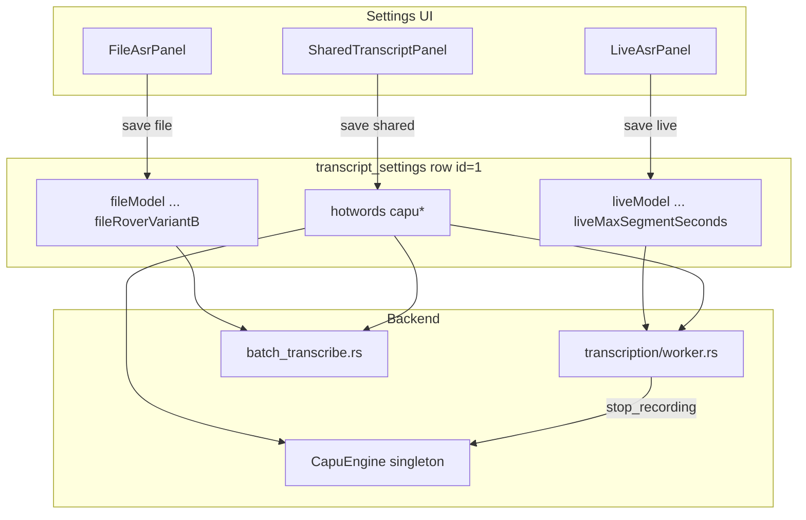

# Tách cấu hình ASR Live vs File trên UI và backend

## Vấn đề

Spec hiệu năng [2026-08-04-asr-pipeline-performance-design.md](2026-08-04-asr-pipeline-performance-design.md)
đã tách **pipeline xử lý** thành 2 luồng Rust độc lập:

| Luồng | Entry | Đặc điểm |
|---|---|---|
| **Live** | `transcription/worker.rs` | 1 ASR worker, emit ITN real-time; **CAPU chỉ khi kết thúc cuộc họp** (thay đổi trong spec này) |
| **File** | `batch_transcribe.rs` ← `import.rs` / `retranscription.rs` | 2 ASR workers (khi đủ segment + CPU), CAPU gộp lô |

Nhưng **UI và persistence vẫn dùng một bộ cấu hình**:

- Một component `AsrModelManager` trong Settings → tab "Nhận dạng"
- Một bản ghi `transcript_settings` (SQLite) + `api_save_transcript_config`
- Live, import file, retranscription đều đọc `SettingsRepository::get_transcript_config()`

App tham chiếu (`test ASR`) đã tách từ lâu:

- **2 tab UI**: `tab_live.py` vs `tab_file.py`, mỗi tab có combo Model riêng
- **2 section config**: `LiveSettings` vs `FileSettings` trong `config.ini`
- Model live mặc định khác file (streaming vs offline/ROVER)

Người dùng kỳ vọng: sau khi backend tách luồng, có thể chọn model **nhanh cho live** và model **chính xác/ROVER cho file** — không bị ràng buộc một lựa chọn duy nhất.

Spec CAPU trước ([2026-08-04-capu-punctuation-settings-design.md](2026-08-04-capu-punctuation-settings-design.md))
cố ý **không** tách Live/File cho **cài đặt** CAPU (1 bộ slider, 1 `CapuEngine`). Spec này **bổ sung** thay đổi **thời điểm** chạy CAPU trên live:

- **Trong cuộc họp:** chỉ ASR + ITN → UI hiện text thô (không dấu câu).
- **Khi kết thúc ghi âm:** chạy CAPU một lần (gộp lô qua `CapuBatcher`) trên toàn bộ transcript thô, rồi merge vào storage / emit cập nhật.

File/import vẫn chạy CAPU ngay sau ASR (trong `batch_transcribe`) — không đổi.

## Nghiên cứu: app tham chiếu

| Hạng mục | Live (`tab_live.py`) | File (`tab_file.py`) |
|---|---|---|
| Model combo | `zipformer-30m-rnnt-streaming-6000h` (mặc định), offline variants | `zipformer-30m-rnnt-6000h`, `sherpa-onnx-zipformer-vi-2025-04-20`, `ROVER` |
| CPU threads slider | Có (`LiveSettings.cpu_threads`) | Có (`FileSettings.cpu_threads`) |
| ROVER | Không | Có (model `rover-voting`) |
| Diarization / bypass VAD / save RAM | Không | Có |
| Punctuation sliders | Không (file-only trong `get_config`) | Có |
| Config key | `LiveSettings` | `FileSettings` |

**Khác kiến trúc quan trọng:** app tham chiếu live dùng **OnlineRecognizer streaming** — Meetily live vẫn dùng **OfflineRecognizer** (ghi trong ngoài phạm vi spec hiệu năng). Tách UI **không** tự động mang lại model streaming; chỉ cho phép **chọn model offline khác nhau** cho mỗi luồng.

## Ngoài phạm vi

- **Model streaming thật** (`OnlineRecognizer`, chunk-64) cho live — cần spec riêng, thay đổi kiến trúc lớn.
- **Tách cài đặt CAPU** (punctuation/case/threads) theo Live vs File — giữ 1 `CapuEngine` + 1 bộ slider shared.
- **CAPU real-time trong lúc ghi** — bỏ Stage 2 nền + debounce trong `worker.rs`; CAPU live chỉ ở `stop_recording`.
- **Slider số luồng ASR** trên UI — vẫn tự động qua `asr_thread_budget` (spec hiệu năng).
- **Speaker diarization, GPU, bypass VAD, save RAM** của app tham chiếu — không có trong Meetily; không port trong spec này.
- **Tách tab chính** của app (home = live, import = file) — chỉ tách **Settings > Nhận dạng**; flow ghi âm / import file trên home giữ nguyên.
- **Hai instance model loaded cùng lúc** trong RAM lâu dài — live engine và file engine vẫn lazy-load khi cần; không preload cả hai nếu không dùng.

## Các phương án

### A. Hai bản ghi DB (`transcript_settings_live`, `transcript_settings_file`)

- **Ưu:** Rõ ràng, migration đơn giản (copy row cũ → cả hai bảng).
- **Nhược:** Trùng lặp schema; hotwords/CAPU cần bảng thứ ba hoặc cột shared.

### B. Một bảng, prefix cột `live*` / `file*` (khuyến nghị)

- **Ưu:** Một migration ALTER; một row `id='1'`; dễ đọc cả config; khớp tinh thần `LiveSettings`/`FileSettings` của app tham chiếu.
- **Nhược:** Bảng `transcript_settings` dài thêm; cần resolver rõ `AsrPath::Live` vs `AsrPath::File`.

### C. JSON blob `liveConfig` / `fileConfig` trong một cột

- **Ưu:** Migration nhẹ, linh hoạt.
- **Nhược:** Khó query/validate; không khớp pattern migration SQL hiện có; dễ drift schema UI ↔ Rust.

**Khuyến nghị: phương án B** — prefix cột trên `transcript_settings`, resolver typed trong Rust.

## Thiết kế

### 1. Phạm vi field theo luồng

#### 1.1 — Chỉ Live (`live*`)

| Field | Mặc định (migration) | Ghi chú |
|---|---|---|
| `liveModel` | copy từ `model` | Family id (`zipformer-vi-30m`, …) |
| `liveAsrVariant` | copy từ `asrVariant` | `int8` / `full` |
| `liveDecodingMethod` | copy từ `decodingMethod` | |
| `liveNumActivePaths` | copy từ `numActivePaths` | |
| `liveMaxSegmentSeconds` | copy từ `maxSegmentSeconds` | 5–30; chỉ ảnh hưởng VAD/pipeline live |

Live **không** có `roverEnabled` / `roverFamilyB` / `roverVariantB` — ROVER chỉ trên file (giống app tham chiếu: ROVER chỉ ở tab file).

#### 1.2 — Chỉ File (`file*`)

| Field | Mặc định (migration) | Ghi chú |
|---|---|---|
| `fileModel` | copy từ `model` | |
| `fileAsrVariant` | copy từ `asrVariant` | |
| `fileDecodingMethod` | copy từ `decodingMethod` | |
| `fileNumActivePaths` | copy từ `numActivePaths` | |
| `fileMaxSegmentSeconds` | copy từ `maxSegmentSeconds` | VAD khi import / retranscription |
| `fileRoverEnabled` | copy từ `roverEnabled` | |
| `fileRoverFamilyB` | copy từ `roverFamilyB` | |
| `fileRoverVariantB` | copy từ `roverVariantB` | |

#### 1.3 — Shared (giữ nguyên, không prefix)

| Field | Ghi chú |
|---|---|
| `hotwords` | Áp dụng cho mọi ASR decode (cả live và file) |
| `capuCpuThreads`, `capuPunctuationLevel`, `capuCaseLevel` | Singleton `CapuEngine` — spec CAPU |

#### 1.4 — Legacy cột (deprecate dần)

Sau migration, các cột `model`, `asrVariant`, `decodingMethod`, `numActivePaths`, `maxSegmentSeconds`, `roverEnabled`, `roverFamilyB`, `roverVariantB` **không còn được đọc** bởi code mới. Giữ trong DB 1–2 release để rollback; có thể DROP trong migration sau khi ổn định.

**Backward-compat đọc (migration runtime):** nếu `liveModel` NULL (DB cũ chưa migrate), fallback sang `model`.

### 2. Database migration

File: `frontend/src-tauri/migrations/20260805100000_split_live_file_asr_config.sql`

```sql
-- Live path
ALTER TABLE transcript_settings ADD COLUMN liveModel TEXT;
ALTER TABLE transcript_settings ADD COLUMN liveAsrVariant TEXT;
ALTER TABLE transcript_settings ADD COLUMN liveDecodingMethod TEXT;
ALTER TABLE transcript_settings ADD COLUMN liveNumActivePaths INTEGER;
ALTER TABLE transcript_settings ADD COLUMN liveMaxSegmentSeconds INTEGER;

-- File path
ALTER TABLE transcript_settings ADD COLUMN fileModel TEXT;
ALTER TABLE transcript_settings ADD COLUMN fileAsrVariant TEXT;
ALTER TABLE transcript_settings ADD COLUMN fileDecodingMethod TEXT;
ALTER TABLE transcript_settings ADD COLUMN fileNumActivePaths INTEGER;
ALTER TABLE transcript_settings ADD COLUMN fileMaxSegmentSeconds INTEGER;
ALTER TABLE transcript_settings ADD COLUMN fileRoverEnabled INTEGER NOT NULL DEFAULT 0;
ALTER TABLE transcript_settings ADD COLUMN fileRoverFamilyB TEXT;
ALTER TABLE transcript_settings ADD COLUMN fileRoverVariantB TEXT;

-- Backfill from legacy columns
UPDATE transcript_settings SET
  liveModel = model,
  liveAsrVariant = asrVariant,
  liveDecodingMethod = decodingMethod,
  liveNumActivePaths = numActivePaths,
  liveMaxSegmentSeconds = maxSegmentSeconds,
  fileModel = model,
  fileAsrVariant = asrVariant,
  fileDecodingMethod = decodingMethod,
  fileNumActivePaths = numActivePaths,
  fileMaxSegmentSeconds = maxSegmentSeconds,
  fileRoverEnabled = roverEnabled,
  fileRoverFamilyB = roverFamilyB,
  fileRoverVariantB = roverVariantB
WHERE id = '1';
```

Cập nhật `TranscriptSetting` trong `database/models.rs` với các field mới + `FromRow`.

### 3. Rust — resolver và API

#### 3.1 — Enum đường ASR

```rust
// frontend/src-tauri/src/asr_engine/config.rs (module mới)
pub enum AsrPath {
    Live,
    File,
}

pub struct PathAsrConfig {
    pub family_id: String,
    pub variant: ModelVariant,
    pub decoding_method: String,
    pub num_active_paths: i32,
    pub max_segment_seconds: u32,
    pub rover_enabled: bool,           // luôn false cho Live
    pub rover_family_b: Option<String>,
    pub rover_variant_b: Option<String>,
}
```

`SettingsRepository::get_path_asr_config(pool, AsrPath) -> PathAsrConfig` — đọc row, map prefix, fallback legacy nếu cần.

`SettingsRepository::save_live_asr_config(...)` và `save_file_asr_config(...)` — chỉ cập nhật cột của path tương ứng + **không** đụng cột path kia.

`SettingsRepository::save_shared_transcript_config(hotwords, capu_*)` — hoặc giữ trong cùng API save với flag.

#### 3.2 — Call site (đổi nguồn config)

| File | Trước | Sau |
|---|---|---|
| `transcription/engine.rs` | `get_transcript_config` + `rover_enabled` | `get_path_asr_config(Live)` |
| `recording_commands.rs` | `get_max_segment_seconds` | từ `PathAsrConfig` live |
| `import.rs` | `get_transcript_config` + rover | `get_path_asr_config(File)` |
| `retranscription.rs` | idem | idem |
| `rover_engine/commands.rs` | `config.rover_enabled` | chỉ đọc từ **file** config |
| `asr_engine/commands.rs` | load từ global config | `asr_validate_model_ready` nhận optional override từ path (hoặc command riêng `asr_validate_for_path`) |

**Validate / load model:** khi user bấm "Lưu" trên UI live, gọi `asr_validate_model_ready` với family/variant từ **live** config. File panel gọi với **file** config (hoặc `rover_validate_model_ready` nếu ROVER bật).

Khi **bắt đầu ghi âm**, `get_or_init_transcription_engine` load model theo **live** config (unload/reload nếu khác model đang loaded).

Khi **import file**, `import.rs` init ASR/ROVER theo **file** config; nếu model khác live đang loaded → unload live engine trước (hoặc load file worker riêng trong `batch_transcribe` đã có — chỉ cần đúng family từ file config).

#### 3.3 — Tauri commands / API

**Mở rộng** `api_get_transcript_config` trả về:

```json
{
  "live": {
    "model": "zipformer-vi-30m",
    "asrVariant": "int8",
    "decodingMethod": "modified_beam_search",
    "numActivePaths": 15,
    "maxSegmentSeconds": 25
  },
  "file": {
    "model": "gipformer-65m-rnnt",
    "asrVariant": "int8",
    "decodingMethod": "modified_beam_search",
    "numActivePaths": 15,
    "maxSegmentSeconds": 25,
    "roverEnabled": true,
    "roverFamilyB": "sherpa-onnx-zipformer-vi-2025-04-20",
    "roverVariantB": "full"
  },
  "shared": {
    "hotwords": "...",
    "capuCpuThreads": 4,
    "capuPunctuationLevel": 7,
    "capuCaseLevel": 3
  }
}
```

**Thêm** (hoặc mở rộng save):

- `api_save_live_asr_config` — chỉ live fields
- `api_save_file_asr_config` — chỉ file fields + ROVER
- `api_save_shared_transcript_config` — hotwords + CAPU (tách khỏi path để tránh ghi nhầm)

**Giữ** `api_save_transcript_config` 1 release với deprecation log: ghi **cả live và file** cùng giá trị (behavior cũ) để client cũ không vỡ — hoặc map vào live+file nếu payload đầy đủ.

Structs: `LiveAsrConfig`, `FileAsrConfig`, `SharedTranscriptConfig` trong `api/api.rs`.

### 4. Frontend — UI

#### 4.1 — Cấu trúc Settings > Nhận dạng

Thay một `AsrModelManager` monolithic bằng:

```
TranscriptSettings.tsx
├── SharedTranscriptPanel.tsx      // hotwords + CAPU sliders (phần cuối AsrModelManager hiện tại)
└── AsrPathTabs.tsx                // sub-tab nội bộ
    ├── LiveAsrPanel.tsx           // model, variant, decode, max segment — KHÔNG ROVER
    └── FileAsrPanel.tsx           // model, variant, decode, max segment + ROVER block
```

**Sub-tab** dùng pattern giống tab Settings (Radix `Tabs` hoặc nút pill) — **không** thêm tab cấp 1 mới trên sidebar Settings (tránh 6 tab chính).

Mặc định mở sub-tab **"Ghi âm trực tiếp"** — người dùng thường cấu hình trước khi record.

#### 4.2 — Catalog model (live = file, khác description)

Live và file dùng **cùng danh sách** `ASR_MODELS` (đủ 3 family). Không giới hạn subset trên live.

Mở rộng `AsrModelInfo` trong `frontend/src/lib/asr.ts`:

```typescript
export interface AsrModelInfo {
  id: AsrModelFamily;
  label: string;
  description: string;       // mô tả chung (file panel)
  liveDescription?: string;  // cảnh báo / gợi ý khi chọn cho ghi âm trực tiếp
  // ... existing fields
}
```

**Gợi ý `liveDescription` (hiển thị dưới combo khi chọn model trên Live panel):**

| Model | `liveDescription` |
|---|---|
| `zipformer-vi-30m` | Khuyến nghị cho ghi âm trực tiếp — nhanh, ít tốn CPU/RAM. |
| `gipformer-65m-rnnt` | Chính xác hơn nhưng chậm hơn; cuộc họp dài có thể tụt transcript real-time. |
| `sherpa-onnx-zipformer-vi-2025-04-20` | Model lớn (~270 MB), chỉ bản full — không khuyến nghị khi ghi âm liên tục. |

File panel giữ `description` hiện tại (hoặc thêm `fileDescription` nếu cần phân biệt sau).

**Không** thêm model streaming cho v1. Ghi chú chung trên Live panel: *"Dấu câu/viết hoa (CAPU) chỉ áp dụng sau khi kết thúc cuộc họp."*

ROVER = toggle riêng trên File panel, không có trên Live.

#### 4.3 — Hành vi Save / Download

- Mỗi panel có nút **"Lưu cấu hình"** riêng → gọi API path tương ứng.
- Download/load model: chỉ validate model của panel đang lưu (live panel không tải model B).
- `disabled` khi `isRecording` **cho cả hai panel** (đổi model live khi đang ghi vẫn rủi ro).
- Khi import đang chạy: disable file panel (listen `import-progress` hoặc command `is_import_in_progress` nếu có).

#### 4.4 — Shared panel

Di chuyển từ `AsrModelManager`:

- Hotwords textarea
- CAPU: threads, punctuation level, case level
- Nút "Lưu" → `api_save_shared_transcript_config`

#### 4.5 — Onboarding / recording start

- `useRecordingStart` / modal chọn model: kiểm tra **live** model loaded (`asr_is_model_loaded` sau validate live config), không dùng file config.
- `ConfigContext.transcriptModelConfig`: mở rộng thành `liveTranscriptConfig` + `fileTranscriptConfig` hoặc nested object — cập nhật Sidebar nếu còn đọc model cũ.

#### 4.6 — User guide / tour

Cập nhật `settingsTour` nếu có bước trỏ vào `AsrModelManager` — thêm target cho sub-tab live/file.

### 5. Luồng dữ liệu (sau thay đổi)



Trong lúc ghi: Worker chỉ ASR+ITN. Mũi tên `Worker → Capu` chỉ xảy ra tại `stop_recording`.

### 6. Engine lifecycle khi 2 model khác nhau

**Kịch bản:** Live = ZipFormer 30M int8, File = Gipformer + ROVER.

| Hành động | Engine trong RAM |
|---|---|
| App start | Chưa load |
| User lưu live + bấm ghi âm | Load ZipFormer 30M (live) |
| User import file sau khi ghi | `batch_transcribe` spawn worker load Gipformer/ROVER riêng (đã có); live engine có thể vẫn giữ hoặc unload — **ưu tiên:** file job dùng worker-local model (spec hiệu năng), không require unload live |
| User ghi lại sau import | `get_or_init_transcription_engine` so sánh loaded vs live config → reload nếu khác |

**Quy tắc:** Global `AsrEngine` singleton phục vụ **live**. File path dùng engine load trong `batch_transcribe` workers (đã tách). ROVER chỉ file. Tránh load 2 model global cùng lúc.

### 6.1 — CAPU live: chỉ khi kết thúc cuộc họp

**Hiện tại** (`worker.rs`): Stage 1 ASR → ITN → `transcript-update` + đẩy `PendingSegment` vào Stage 2 (`spawn_capu_background_stage`) chạy nền với debounce → `transcript-finalized` có thể fire **trong lúc ghi**.

**Mục tiêu (đã duyệt):**

```
Trong cuộc họp:
  VAD → ASR → ITN → emit transcript-update (text thô)
  (KHÔNG gọi CAPU)

Khi stop_recording:
  1. Drain transcription worker (ASR hết chunk)
  2. finalize_live_with_capu(all raw segments từ recording manager)
  3. replace_transcript_segments / emit transcript-finalized (một hoặc nhiều lô)
  4. Tiếp tục shutdown (unload model, lưu DB, …)
```

**Thiết kế Rust:**

1. **Gỡ** `spawn_capu_background_stage` + `capu_sender` khỏi `start_transcription_task`.
2. **Giữ** `transcript-update` với ITN-only text trong lúc ghi (UI live không đổi hành vi hiển thị thô).
3. **Thêm** `finalize_live_with_capu` (có thể trong `audio/post_asr.rs` hoặc `capu_engine/batch.rs` helper):
   - Input: `Vec<PendingSegment>` hoặc đọc từ `RecordingManager` (sequence_id, raw text, timestamps).
   - Dùng `CapuBatcher` + `CAPU_BATCH_WORD_BUDGET` (không debounce — list đã đủ).
   - Output: danh sách `FinalizedSegment` để `recording_manager.replace_transcript_segments`.
4. **`stop_recording`** (`recording_commands.rs`): sau `task_handle.await` (transcription task), **trước** unlisten `transcript-finalized`:
   - Gọi `finalize_live_with_capu`.
   - Merge kết quả vào recording manager (cùng logic listener `transcript-finalized` hiện có).
   - Emit `recording-shutdown-progress` stage `applying_punctuation` (~60%).
5. **Frontend:** trong lúc ghi, transcript hiện text thô; sau stop, UI nhận segment đã merge (listener hiện có hoặc reload từ manager). Có thể emit `transcript-batch-finalized` một lần nếu cần refresh UI — hoặc tái dùng nhiều `transcript-finalized`.

**Shared CAPU settings** (`capuPunctuationLevel`, `capuCaseLevel`, `capuCpuThreads`) áp dụng khi bước finalize chạy — không cần cột DB riêng cho live.

**Lợi ích:** Giảm CPU tranh chấp ASR vs CAPU trong lúc ghi (phù hợp spec hiệu năng); khớp kỳ vọng người dùng "đúng khi xong họp".

### 7. Kiểm thử

#### 7.1 — Unit / Rust

- `get_path_asr_config(Live)` / `File` đọc đúng cột sau migration backfill.
- Fallback legacy khi `liveModel` NULL.
- `save_live_asr_config` không đổi `fileModel`.
- `transcription/engine.rs`: `is_rover_enabled` → false khi chỉ đọc live config (ROVER chỉ file).

#### 7.2 — Integration

1. Set live = 30M, file = 65M + ROVER → ghi âm → transcript OK với 30M (text thô trong lúc ghi).
2. Stop recording → transcript có dấu câu (CAPU chạy sau ASR drain).
3. Import cùng file → transcript dùng 65M/ROVER (log family trong batch).
4. Đổi chỉ live model → file config không đổi trong DB.
5. Migration từ DB cũ: cả live và file nhận giá trị cũ.
6. Cuộc họp ngắn (~30s): CAPU vẫn chạy một lần ở stop — không mất đoạn cuối.

#### 7.3 — UI manual

- Sub-tab chuyển đổi, save độc lập, recording disables both path panels.
- Onboarding / start recording chỉ cảnh báo thiếu **live** model.

### 8. Lộ trình triển khai (gợi ý)

| Phase | Nội dung | Rủi ro |
|---|---|---|
| **P1** | Migration + `PathAsrConfig` + đổi call site backend | Trung bình — nhiều file Rust |
| **P2** | API get/save tách path + deprecate save cũ | Thấp |
| **P3** | UI sub-tab + tách component | Trung bình — `AsrModelManager` ~800 dòng |
| **P4** | Onboarding + ConfigContext + tour | Thấp |

Ước lượng: **1 spec implementation plan** (~15–25 task), không cần tách thành 2 PR nếu làm tuần tự P1→P3.

### 9. Rủi ro và giảm thiểu

| Rủi ro | Giảm thiểu |
|---|---|
| User confused "2 model" | Mô tả ngắn trên mỗi sub-tab; default giống nhau sau migration |
| Client cũ gọi `api_save_transcript_config` | Deprecation: ghi cả 2 path cùng giá trị 1 release |
| CAPU spec nói "không tách Live/File" | Chỉ tách ASR; CAPU vẫn shared — cập nhật footnote trong spec CAPU |
| Kỳ vọng model streaming trên live | UI text + ngoài phạm vi rõ ràng |
| `AsrModelManager` refactor lớn | Tách panel trước, xóa file cũ sau khi test |

## Tiêu chí hoàn thành

- [ ] Settings hiển thị 2 sub-tab **Ghi âm trực tiếp** / **Nhập file** + block **Chung** (hotwords + CAPU).
- [ ] Live model combo hiển thị **đủ** danh sách như file, với `liveDescription` cảnh báo.
- [ ] Live và file có thể lưu **khác model**; DB phản ánh đúng sau reload app.
- [ ] Ghi âm dùng live config; import/retranscription dùng file config (+ ROVER chỉ file).
- [ ] **CAPU live chỉ chạy khi kết thúc cuộc họp** — không `transcript-finalized` trong lúc ghi.
- [ ] Migration backfill không làm mất cấu hình hiện có.
- [ ] `cargo test` + smoke test UI theo mục 7.

## Tài liệu liên quan

- [2026-08-04-asr-pipeline-performance-design.md](2026-08-04-asr-pipeline-performance-design.md) — pipeline backend đã tách
- [2026-08-04-capu-punctuation-settings-design.md](2026-08-04-capu-punctuation-settings-design.md) — CAPU shared (không đổi trong spec này)
- App tham chiếu: `test ASR/tab_live.py`, `tab_file.py`, `app.py` (`LiveSettings` / `FileSettings`)
