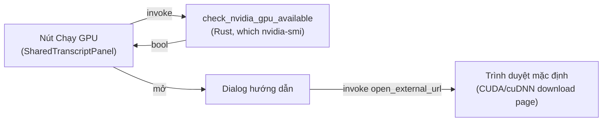

# Nút "Chạy GPU" — hướng dẫn cài CUDA cho tăng tốc ASR

## Vấn đề

Trong phiên debug hiệu năng ASR (xem log benchmark, không phải spec riêng), phát hiện:

- App hỗ trợ build với `--features cuda` (`Cargo.toml:26`, `cuda = ["ort/cuda"]`), ảnh hưởng đến ROVER RNNT decoder (`rnnt_decoder/sessions.rs`) và CAPU punctuation engine (`capu_engine/capu_engine.rs`).
- Trên máy có GPU NVIDIA nhưng cài **CUDA Toolkit 13.2** (bản mới nhất), CUDA execution provider vẫn **fallback về CPU** ở runtime — lỗi `ort::execution_providers`: *"CUDA execution provider is not enabled in this build"*.
- Nguyên nhân xác minh bằng `dumpbin /dependents`: `onnxruntime_providers_cuda.dll` (tải qua crate `ort`) cần **CUDA 12.x runtime** (`cudart64_12.dll`, `cublas64_12.dll`, `cublasLt64_12.dll`, `cufft64_11.dll`) + **cuDNN 9** (`cudnn64_9.dll`). CUDA Toolkit 13.2 xuất ra `cublas64_13.dll` — khác tên, không tương thích.
- Người dùng thông thường không biết điều này — cài CUDA Toolkit bản mới nhất (hành vi tự nhiên) vẫn sẽ gặp lại đúng lỗi này và tưởng GPU không hỗ trợ.

App hiện **không có bất kỳ UI nào** cho biết trạng thái GPU/CUDA hay hướng dẫn cài đặt (xác nhận: không có text "GPU"/"CUDA" nào trong `frontend/src/`). `hardware_detector.rs` có `has_cuda_support()` nhưng chỉ dò biến môi trường `CUDA_PATH`/`CUDA_HOME`, không expose ra Tauri command, và không thực sự xác nhận GPU chạy được (chỉ biết có cài path, không biết có đúng version).

## Ngoài phạm vi

- **Không** tự động cài CUDA/cuDNN cho người dùng (không tải/chạy installer từ trong app).
- **Không** bundle CUDA/cuDNN runtime DLL vào app (đã đánh giá: ~2.1GB, quyết định không theo hướng này — xem hội thoại).
- **Không** kiểm tra chi tiết "CUDA có thực sự chạy được" (đúng DLL, đúng version) — chỉ kiểm tra **có GPU NVIDIA hay không** (qua `nvidia-smi`), theo đúng phạm vi người dùng chọn.
- **Không** đổi cờ build mặc định (`cuda` vẫn là feature opt-in như hiện tại) — đây thuần là tính năng hướng dẫn/thông tin.
- **Không** áp dụng cho macOS (Metal) / AMD-Intel (Vulkan) — chỉ nhắm NVIDIA/CUDA vì đó là thứ đã debug trong phiên này.

## Thiết kế

### 1. Backend — Tauri command mới

File: `frontend/src-tauri/src/lib.rs` (cạnh các command đơn giản khác như `is_recording`).

```rust
#[tauri::command]
fn check_nvidia_gpu_available() -> bool {
    which::which("nvidia-smi").is_ok()
}
```

- Dùng lại đúng cách `build.rs:50` đã dùng để báo GPU lúc build (`which::which("nvidia-smi")`) — nhất quán logic, không cần biết thêm gì về driver/CUDA.
- `which` đã là runtime dependency (`Cargo.toml:61`, đã dùng thực tế ở `audio/ffmpeg.rs:10`) — không cần thêm dependency mới.
- Đăng ký trong `generate_handler![...]` (`lib.rs`, cạnh `is_recording`).
- Đặt tên `check_nvidia_gpu_available` (không phải `check_gpu_available` chung chung) vì chỉ dò NVIDIA — tránh hiểu nhầm cũng áp dụng cho AMD/Intel.

### 2. Frontend — component mới

File mới: `frontend/src/components/GpuSetupGuidance.tsx`.

Đặt trong `SharedTranscriptPanel.tsx` ("Cấu hình chung") — vì CUDA là thiết lập cấp máy/app, ảnh hưởng cả CAPU (shared) lẫn ROVER (file), không riêng live hay file.

**State:**
```typescript
const [checking, setChecking] = useState(false);
const [hasGpu, setHasGpu] = useState<boolean | null>(null);
const [dialogOpen, setDialogOpen] = useState(false);
```

**Hành vi nút "Chạy GPU":**
1. `onClick` → `setChecking(true)` → `invoke<boolean>('check_nvidia_gpu_available')`.
2. Nhận kết quả → `setHasGpu(result)` → `setDialogOpen(true)` → `setChecking(false)`.
3. Lỗi invoke (hiếm, nhưng xử lý theo pattern try/catch có sẵn trong codebase) → toast lỗi ngắn (`sonner`), không mở dialog.

**Dialog** (dùng `Dialog`/`DialogContent`/`DialogHeader`/`DialogTitle`/`DialogFooter` từ `components/ui/dialog.tsx`, theo pattern `TranscriptRecovery.tsx:119-126`):

- **`hasGpu === true`:**
  - `DialogTitle`: "Đã phát hiện GPU NVIDIA"
  - Nội dung: giải thích ngắn gọn cần **CUDA 12.x Runtime** (không phải bản mới nhất) + **cuDNN 9**, vì onnxruntime GPU của app build với CUDA 12.x.
  - Ghi chú rõ: "Không tải bản CUDA Toolkit mới nhất trên trang chủ — hãy chọn bản 12.x trong trang Archive."
  - 2 nút mở link ngoài (qua `invoke('open_external_url', { url })`, pattern có sẵn ở `appUpdate.ts:145`):
    - "Tải CUDA Toolkit 12.x" → `https://developer.nvidia.com/cuda-toolkit-archive`
    - "Tải cuDNN 9" → `https://developer.nvidia.com/cudnn` (kèm dòng chú thích cần tài khoản NVIDIA Developer miễn phí)
  - Dòng cuối: "Cài xong, khởi động lại MeetingOne để áp dụng."
- **`hasGpu === false`:**
  - `DialogTitle`: "Không phát hiện GPU NVIDIA"
  - Nội dung: máy không có GPU NVIDIA (hoặc driver chưa cài) — app sẽ tiếp tục chạy tối ưu ở chế độ CPU, không cần thao tác gì thêm.

**Nút chính** trong `SharedTranscriptPanel.tsx`:
```tsx
<Button variant="outline" onClick={handleCheckGpu} disabled={checking}>
  {checking ? 'Đang kiểm tra...' : 'Chạy GPU'}
</Button>
```

### 3. Luồng dữ liệu



## Kiểm thử

- **Rust**: `check_nvidia_gpu_available` phụ thuộc trạng thái máy thật (`nvidia-smi` có trên PATH hay không) — không unit-test có ý nghĩa (cùng lý do `hardware_detector.rs` hiện không unit-test phần dò phần cứng). Verify bằng chạy `cargo build` + gọi thử trong app.
- **Frontend/manual** (theo CLAUDE.md — chạy app thật, không chỉ code review):
  1. Mở Settings → Transcription Models → mục "Cấu hình chung" → bấm "Chạy GPU".
  2. Trên máy có GPU NVIDIA: xác nhận dialog hiện đúng hướng dẫn CUDA 12.x + cuDNN 9, 2 nút mở đúng URL.
  3. Giả lập máy không GPU (khó test thật trên máy dev hiện tại vì có GPU) — review code path `hasGpu === false` bằng cách tạm mock giá trị trả về, hoặc chấp nhận review logic thay vì test runtime cho nhánh này.
  4. Bấm nút 2 lần liên tiếp — không bị kẹt trạng thái `checking`.

## Tiêu chí hoàn thành

- [ ] Command `check_nvidia_gpu_available` hoạt động, đăng ký trong `generate_handler!`.
- [ ] Nút "Chạy GPU" xuất hiện trong `SharedTranscriptPanel.tsx`.
- [ ] Dialog hiện đúng nội dung cho cả 2 trường hợp có/không GPU.
- [ ] 2 link mở đúng qua `open_external_url` (CUDA Toolkit Archive, cuDNN).
- [ ] `cargo build` sạch, `pnpm run tauri:dev:cuda` chạy thử trong app thật, bấm nút xác nhận UI đúng.

## Tài liệu liên quan

- [2026-08-04-asr-pipeline-performance-design.md](2026-08-04-asr-pipeline-performance-design.md) — nơi CUDA feature cho ROVER/CAPU được thêm vào.
- [2026-08-05-live-file-asr-settings-split-design.md](2026-08-05-live-file-asr-settings-split-design.md) — cấu trúc `SharedTranscriptPanel.tsx` nơi tính năng này được gắn vào.
